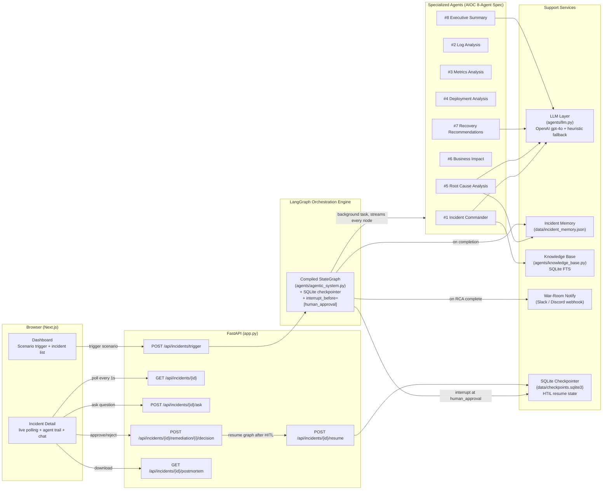
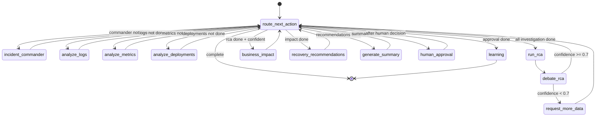
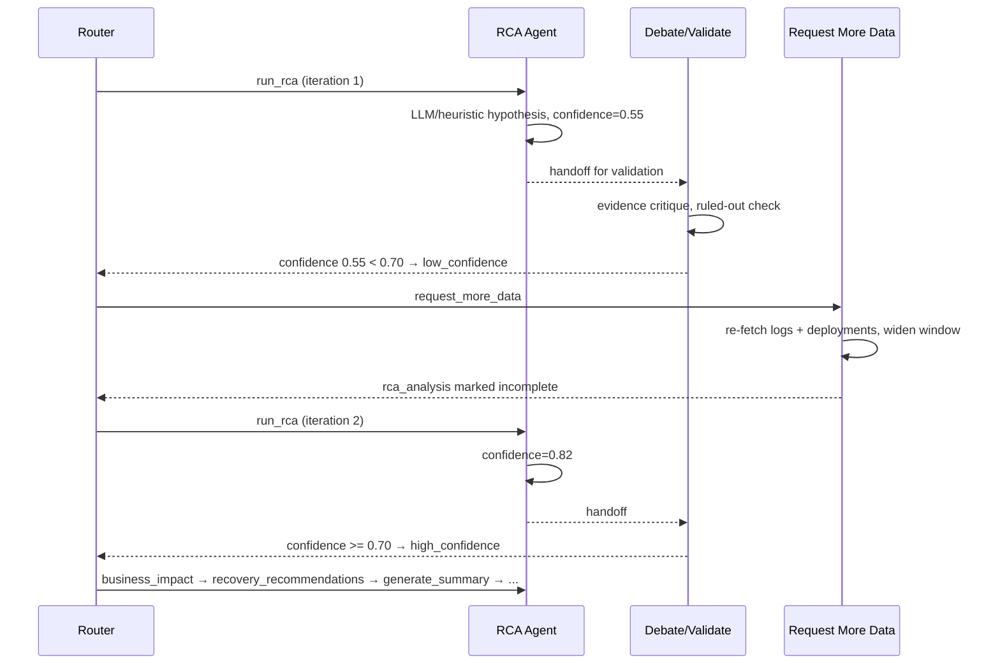

# Architecture

Technical deep-dive into how the AI Operations Command Center is built. For a project overview, see [SUBMISSION.md](SUBMISSION.md). For the end-to-end run-through, see [WORKFLOW.md](WORKFLOW.md).

## 1. System Overview

**Three-tier design**: a stateless FastAPI layer for I/O, a LangGraph engine that owns orchestration state and control flow, and single-responsibility agent functions that are pure `IncidentState → IncidentState` transforms. No agent calls another agent directly — everything is mediated by the graph.

---

## 2. The Agent Graph — 8 Agents Matching AIOC.md

Every transition passes back through `route_next_action` — a single decision point (`agents/router_agent.py`). This is deliberate:

- **`valid_next_actions(state)`** is the deterministic guardrail — computes the legal action set from `completed_steps` and `rca_confidence`. Impossible to hallucinate past.
- **`route_next_action_agentic(state)`** hands that legal set to the LLM as a constrained choice ("pick exactly one of these"). If the LLM picks something outside the legal set, the guardrail overrides it and logs `source: "guardrail"`.
- With zero or one legal actions, the LLM is not called — nothing to decide.

---

## 3. The Self-Correcting Confidence Loop

Most incident-response demos run analysis once and print a result. This system treats a low-confidence hypothesis as a reason to keep investigating:

The confidence calculation incorporates evidence from log anomalies, metric anomalies, and **deployment_analysis** (including `correlation_summary`, `overall_risk`, `risk_level`, and `recommended_action`). When `deployment_analysis` indicates a high‑risk deployment without sufficient rollback evidence, the LLM may assign lower confidence, prompting an additional data‑gathering iteration. The loop is bounded by `max_iterations` (default 10). Every iteration is recorded in `agent_invocations` with the confidence at that point — visible live in the UI audit trail.

---

## 4. Real Human-in-the-Loop (HITL) — How It Works

The graph is compiled with `interrupt_before=["human_approval"]` and a `SqliteSaver` checkpointer. This means:

1. Graph runs automatically from `incident_commander` → ... → `generate_summary`
2. Before entering `human_approval`, LangGraph **pauses and persists** the full graph state to `data/checkpoints.sqlite3` (keyed by `incident_id`)
3. Incident `lifecycle_status` is set to `needs_human_review`
4. The UI shows pending remediation items with Approve/Reject buttons
5. Engineer reviews `recovery_plan.steps` — each high‑risk step shows `requires_approval: true`
6. Engineer calls `POST /api/incidents/{id}/remediation/{step}/decision` for each decision
7. Once decisions are recorded, `POST /api/incidents/{id}/resume` is called
8. LangGraph resumes from the checkpoint — the `human_approval` node runs, records the decision audit trail, and continues

This is a genuine graph-level pause/resume — not a flag-in-state simulation.

**Deployment‑related approvals**: steps flagged with `requires_approval: true` typically involve rollback, major configuration changes, or other deployment‑sensitive actions. These appear as distinct approval items in the UI, ensuring explicit human sign‑off on any deployment‑related intervention.

---

## 5. Evidence-Graded RCA (Anti-Hallucination)

`agents/rca_agent.py` constrains the LLM answer via a strict JSON schema (`RCA_SCHEMA`):

- **`supporting_evidence`** — every item must cite something literally present in the log/metric/deployment payloads
- **`ruled_out_hypotheses`** — the model is required to name 2 alternative causes it considered and the specific data point that eliminated each out (differential diagnosis pattern)
- **`deploy_correlation`** — if a deployment timestamp precedes the incident within a plausible window, this field is produced deterministically by `rca_analysis.py::_deploy_correlation` as a fallback, and reasoned about by the LLM when available

---

## 6. Deployment Analysis Agent — Why It's Separate

The previous architecture buried deployment correlation inside the RCA agent. This caused a bias: the LLM would anchor its root cause hypothesis on the deployment before weighing log and metric evidence.

The dedicated `deployment_analysis` agent runs **before** RCA. It produces a structured report (`deployment_analysis` field on state) with:
- Temporal correlation classification (`likely_trigger` / `probable_cause` / `possible_cause` / `historical`)
- Risky change flags (pool sizes, connection limits, timeouts, retry configs, env vars)
- Overall risk level (`high` / `medium` / `low`)
- One‑sentence correlation summary

The RCA agent then reads this as input — grounded evidence, not a hypothesis.

---

## 7. Recovery Recommendation Agent — Why It's Separate

The previous architecture merged recovery recommendations with the Executive Summary agent. This conflated two very different things:
- What engineers should **do** (ordered, risk‑tagged, approval‑gated steps)
- What leadership should **know** (narrative, business impact, timeline)

The dedicated `recovery_recommendations` agent (`agents/recovery_recommendations.py`) runs before the Executive Summary. It produces:
- `recovery_recommendations` (flat list of action strings — backward compatible)
- `recovery_plan` (structured object: prioritised steps, rollback recommendation, safety checks, escalation trigger)

High‑risk steps (`requires_approval: true`) surface in the UI as approval‑required items in the HITL gate.

---

## 8. IncidentState — The Shared Contract

| Section | Set by | Read by |
|---|---|---|
| `raw_logs`, `raw_metrics`, `deployment_changes` | incident_commander | log_analysis, metrics_analysis, deployment_analysis, rca_agent |
| `log_anomalies`, `log_context_cache` | log_analysis | rca_agent, business_impact, executive_summary |
| `metric_anomalies` | metrics_analysis | rca_agent, business_impact, executive_summary |
| `deployment_analysis` | deployment_analysis | rca_agent, recovery_recommendations, executive_summary |
| `root_cause`, `rca_confidence` | rca_agent | router (loop decision), business_impact, executive_summary, memory |
| `affected_users`, `estimated_revenue_impact_per_minute` | business_impact | recovery_recommendations, executive_summary, notify |
| `recovery_recommendations`, `recovery_plan` | recovery_recommendations | executive_summary, human_approval, postmortem export |
| `engineering_summary`, `executive_summary` | executive_summary | UI, postmortem export |
| `agent_invocations` | every agent (append-only) | UI audit trail, postmortem timeline |
| `completed_steps`, `current_status`, `next_action` | router + each node | router (control flow), UI status banner |

`completed_steps` is `List[str]` (not `Set`) for JSON‑serialization compatibility with the SQLite checkpointer.

---

## 9. Live Streaming

`app.py::_run_analysis` uses `graph.astream(..., stream_mode="values")` and writes the incident record to `incident_store` **after every single node**. The frontend polls `GET /api/incidents/{id}` every second and re‑renders. The status banner cycles through all 8 agent phases in real time.

---

## 10. Tech Stack

| Layer | Choice | Why |
|---|---|---|
| Orchestration | LangGraph (`StateGraph`) | Conditional edges give a real state machine with loops and HITL, not a linear chain |
| HITL Persistence | `langgraph-checkpoint-sqlite` | Graph state survives restarts; resume is one `ainvoke(None, config=thread_id)` call |
| LLM | OpenAI `gpt-4o`, strict JSON schema mode | Structured outputs eliminate parsing failures; strict mode rejects malformed shapes |
| Backend | FastAPI + `asyncio.create_task` | Non‑blocking trigger; analysis streams in background while UI polls |
| Frontend | Next.js | Dashboard + incident detail with live polling, agent trail, voice assistant |
| Knowledge Base | SQLite FTS (`agents/knowledge_base.py`) | Zero‑dependency offline RAG; swap‑in‑ready for Qdrant/pgvector |
| Notifications | Slack/Discord incoming webhook | One `.env` var (`WAR_ROOM_WEBHOOK_URL`), zero SDK dependency |
| Testing | pytest + asyncio, 17 tests | Router coverage, graph compilation, 8‑agent node presence, full e2e |
  
---

## 11. Extensibility

To add a new investigative capability (e.g., distributed‑tracing agent):

1. Add fields to `IncidentState` for its outputs.
2. Write `agents/tracing_analysis.py` exposing `tracing_analysis(state) -> state`.
3. Add a node + `completed_steps` entry in `agentic_system.py`.
4. Add the action to `valid_next_actions` in `router_agent.py`.

No changes needed anywhere else — the router, streaming loop, audit trail, and UI all generalize automatically because they iterate over `agent_invocations` and `completed_steps`.